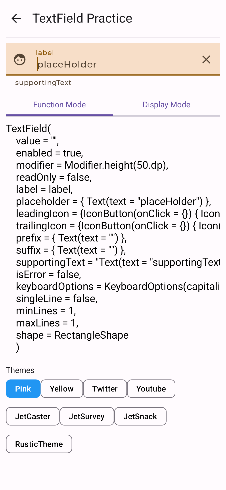
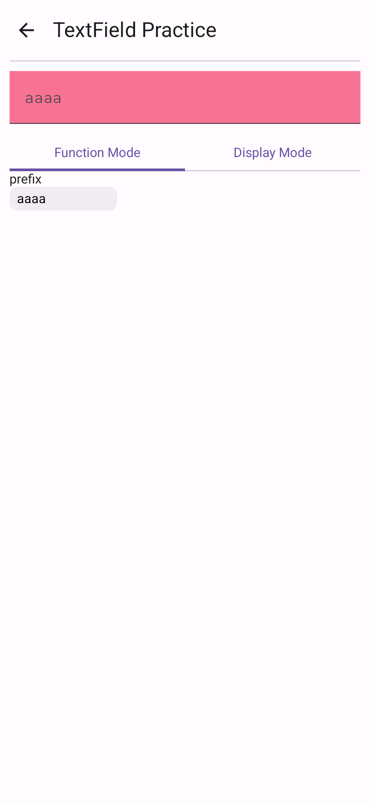
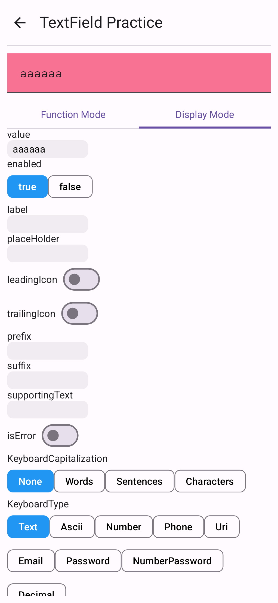

# Compose TextField 연습 APP

TextField의 파라미터들을 앱에서 직접 입력하며 확인해 볼 수 있는 앱.

## Feature

### function mode
기능에 대한 작명을 하기 어려워 일단 지은 이름이다.
함수안에 있는 파라미터를 클릭하여 값을 넣는 모드이다.

### Display mode
파라미터들을 바로 입력할 수 있게 나열해 놓은 모드이다.

